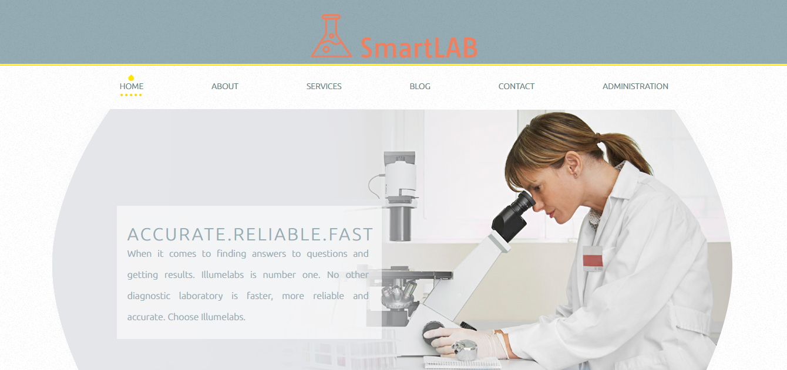

## Introduction

SmartLab is a web application allowing you to effectively manage an analysis laboratory.

## Informations

 - Status: under development 
 - Lastest version: 1.0 
 - Sector: medical 
 - Created: October 2020 
 - Last updated: October 2020

## Table of contents
* [Documentation](#general-info)
* [Demo](#demo)
* [Screenshots](#screenshots)
* [Technologies](#technologies)
* [Setup](#setup)
* [Features](#features)
* [Status](#status)
* [Contact](#contact)
* [License](#license)

## Documentation
Please read the [documentation](https://github.com/aniskchaou/SMARTLAB-FRONTEND-CLIENT/wiki) page for more details.

## Demo
[smart-lab-client.herokuapp.com/](https://smart-lab-client.herokuapp.com/ "https://smart-lab-client.herokuapp.com/")

## Screenshots

## Technologies
* Node.js
* Sequelize
* Express.js
* Vue.js

## Setup

## Features
-   Manage patients
-   track analysis
-   track analysis payment
-   Manage doctors
## Status
Project is: _ in pregress _

## Contact
contact@delta-dev-software.com

## License
<a href="license.txt">MIT License</a>